# 20.10.16 20:48 Hierholzer’s algorithm for k-cpp复现实验

### 寻找欧拉回路

* 代码源 https://www.bilibili.com/video/BV184411Wdd7Ni?from=search&seid=9027021939852634156


```python
import numpy as np
import copy
from matplotlib import pyplot as plt
```


```python
findPath=False
path=[1]
euler={1:{2,4},
       2:{1,3,4,5},
       3:{2,4},
       4:{1,2,3,5},
       5:{2,4,6,9},
       6:{5,7,8,9},
       7:{6,9},
       8:{6,9},
       9:{5,6,8,7}
       }
posx=[0,1,5,3,5,10,12,20,15,20]
posy=[0,10,20,10,5,10,10,20,10,5]
visit=np.zeros((10,10))
for k1 in euler:
    for k2 in euler[k1]:
        visit[k1][k2]=1

```


```python
def draw():
    allx=[posx[x] for x in path]
    ally=[posy[y] for y in path]
    for i in range(1,len(path)+1):#从1到路长+1
        p=path[0:i]
        X=[posx[x] for x in p]
        Y=[posy[y] for y in p]
        plt.clf() # Clear figure清除所有轴，但是窗口打开，这样它可以被重复使用
        plt.xlim([0,25])
        plt.ylim([0,25])
        plt.plot(allx,ally)#在路径中的点plot
        plt.plot(X,Y,)#当前路径中的点plot
        plt.show()
        plt.draw()
    plt.show
```


```python
def DFS(v:int):#实参的类型
    global findPath,path# 使用函数外的变量 为啥euler没声明
    if sum(sum(visit))==0 or findPath:# 如果找到了回路就打印并画图
        print(path)
        draw()
        exit(0)
    for i in euler[v]:
        if visit[v][i]==1:# 遍历
            visit[v][i] = 0
            visit[i][v] = 0
            path.append(i)
            DFS(i)
            path.pop()#默认删除path中的最后一个值
            visit[v][i]=1
            visit[i][v]=1
def ifeuler(tu:{}):#字典
    for i in range(1,len(tu)+1):
        if len(tu[i])%2==1:
            return False
    return True

DFS(1)
            
        
```

    [1, 2, 3, 4, 2, 5, 9, 8, 6, 9, 7, 6, 5, 4, 1]


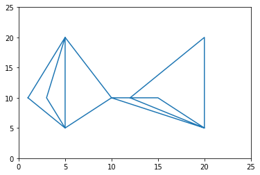


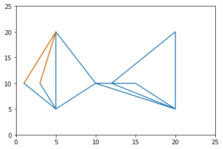


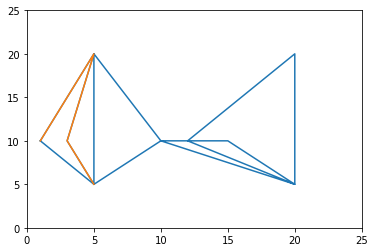


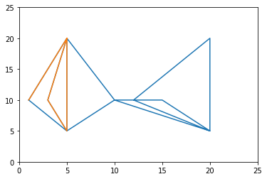


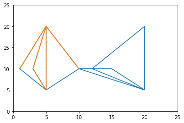


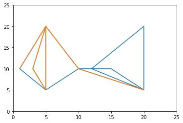


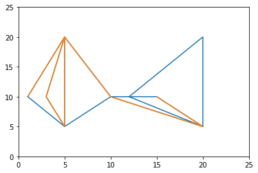


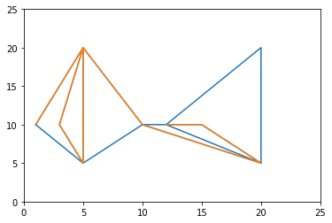


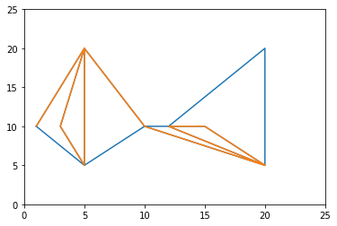


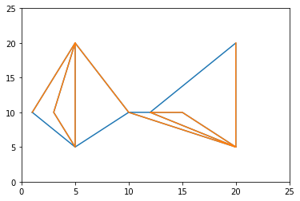


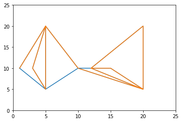


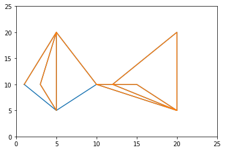


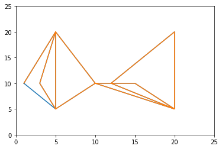


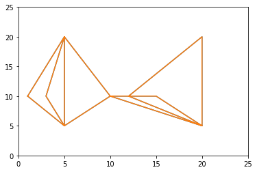


    <Figure size 432x288 with 0 Axes>


### dfs寻找环


```python
from copy import deepcopy as dc

# 用集合去除重复路径
ans = set()

def dfs(graph,trace,start):
    trace = dc(trace)  # 深拷贝，对不同起点，走过的路径不同

    # 如果下一个点在trace中，则返回环
    if start in trace:
        index = trace.index(start)
        tmp = [str(i) for i in trace[index:]]
        ans.add( str(' '.join(tmp)))
        #print(trace[index:])
        return

    trace.append(start)

    # 深度优先递归递归
    for i in graph[start]:
        dfs(graph,trace,i)
 
graph = {1: [2], 2: [3], 3: [1,4,5], 4: [1], 5:[3]}  # 包含大小环test图

dfs(graph,[],1)

print(ans)
```

    {'1 2 3', '3 5', '1 2 3 4'}


### modified dfs寻找环


```python
from copy import deepcopy as dc

# 用集合去除重复路径
ans = set()
found = 0

def dfs(graph,trace,start):
    trac = dc(trace)  # 深拷贝，对不同起点，走过的路径不同
    global found;
    # 如果下一个点在trace中，则返回环
    if start in trac:
        index = trac.index(start)
        tmp = [str(i) for i in trac[index:]]
        arc_list = trac[index:]
        
        ans.add( str(' '.join(tmp)))
        #print(trace[index:])
        found = 1
        return

    trac.append(start)

    # 深度优先递归递归
    for i in graph[start]:
        dfs(graph,trac,i)
        if found==1:
            break
 
graph = {1: [2], 2: [3], 3: [1,4,5], 4: [1], 5:[3]}  # 包含大小环test图

dfs(graph,[],1)

print(ans)
```

    {'1 2 3'}


###  Hierholzer’s algorithm for k-cpp

* 复现Hierholzer’s algorithm算法可用于subtour detection

* 算法来源《ON THE BALANCED K-CHINESE POSTMEN PROBLEMS》


```python
### 2020.10.15 detect subtours

### 2020.10.16 20:27 调试成功两个图均可导出正确答案

from copy import deepcopy as dc
from gurobipy import *

# 用集合去除重复路径
ans = set()
found = 0

# 判断是否所有的边都遍历了
arc_list = []

S = []


def dfs(graph, trace, start):
    trac = dc(trace)  # 深拷贝，对不同起点，走过的路径不同
    global found, arc_list;
    # 如果下一个点在trace中，则返回环
    if start in trac:
        index = trac.index(start)
        tmp = [str(i) for i in trac[index:]]
        arc_list = trac[index:]
        arc_list.append(trac[index])
        ans.add(str(' '.join(tmp)))
        found = 1
        return
    trac.append(start)
    # 深度优先递归递归
    for i in graph[start]:
        dfs(graph, trac, i)
        if found == 1:
            break


graph = {1: [2, 3], 2: [3], 3: [1, 4, 5], 4: [1], 5: [3]}  # 包含大小环test图
#graph = {1: [2], 2: [3], 3: [1], 4: [5, 6], 5: [4, 4], 6: [5]}
# tuple_graph = [(i,graph[i][j]) for j in range(len(graph[i])) for i in graph ]
tuple_graph = []
for i in graph:
    for j in range(len(graph[i])):
        tuple_graph.append((i, graph[i][j]))
visitdic = {tuple_graph[i]: 0 for i in range(len(tuple_graph))}
dfs(graph, [], 4)

print(ans)
print(arc_list)
arc_list0 = arc_list

# 判断是否全部包含原图，是则结束，否则标记已遍历的弧
tuple_arc = [(arc_list[i], arc_list[i + 1]) for i in range(len(arc_list) - 1)]  # Ci-1
print(tuple_arc)
#去除已经成环的弧段

tuple_graph_reduce=dc(tuple_graph)
for i in tuple_arc:
    tuple_graph_reduce.remove(i)
##标记
count = 0
for i in tuple_arc:
    if i in tuple_graph:
        visitdic[i] = visitdic[i] + 1
        count = count + 1
arc_list_last = arc_list0
arc_list_current = arc_list0

while 1:
    arc_list_last = arc_list_current
    c=0
    for i in visitdic:
        c = visitdic[i]+c
    if c == len(tuple_graph):
        break;  ###stop
    else:  ###Step 1 构建一个新circuit
        for i in visitdic:
            if visitdic[i] == 0:#visitdic[i] < visitmax[i]
                found = 0
                graph={i:[] for i in range(1,7)}
                for j in range(len(tuple_graph_reduce)):
                    graph[tuple_graph_reduce[j][0]].append(tuple_graph_reduce[j][1])
                dfs(graph, [], i[1])  # Ci
                # 判断是否全部包含原图，是则结束，否则标记已遍历的弧
                tuple_arc = [(arc_list[i], arc_list[i + 1]) for i in range(len(arc_list) - 1)]  # Ci-1
                #print(tuple_arc)
                # 去除已经成环的弧段
                for i in tuple_arc:
                    tuple_graph_reduce.remove(i)
                break
            # if arc_list_current==[]:
            #     arc_list_current = arc_list_last
            # arc_list_current = arc_list
        # tuple_arc1=[(arc_list[i],arc_list[i+1]) for i in range(len(arc_list)-1)]#
        a = [x for x in arc_list if x in arc_list_last]  ##共同点 当前和上一个
        if len(a) != 0:  ###step2 如果这里有一个共同点在已建圈和上一个圈之间
            #arc_list[arc_list.index(a[0]):len(arc_list-2)]
            if arc_list.index(a[0]) > 1:
                arc_list.append(arc_list[1: arc_list.index(a[0])-1])
                arc_list.remove(arc_list[0: arc_list.index(a[0])-1])
            elif arc_list.index(a[0]) == 1:
                arc_list.remove(arc_list[0])
            elif arc_list.index(a[0]) == 0:
                arc_list.pop()
            arc_list_current[arc_list_current.index(a[0]) :arc_list_current.index(a[0]) ] = arc_list ###建立一个新的Ci
            if S != []:
                for i in S:
                    b = [x for x in i if x in arc_list_current];  ###Step 2.1 判断是否在S和Ci间存在共同点
                    if len(b) != 0:
                        arc_list_current[arc_list_current.index(b[0]):arc_list_current.index(b[0])] = i  ##i是指每一个subtours
                        S.remove(i)  # 同时删除Subtour集合里的subtours

                        ##保持不变
        else:  ###Step 3 如果没有共同点 在上一个环和当前环中 说明当前环是一个subtour
            if S == []:
                S.append(arc_list)
            else:
                for i in S:
                    b = [x for x in i if x in arc_list_current];  ###Step 2.1 判断是否在S和Ci间存在共同点
                    if len(b) != 0:
                        i[i(b[0]):i(b[0])] = arc_list  ##i是指每一个subtours
                    else:
                        S.append(arc_list)
        tuple_arc_ci = [(arc_list_current[i], arc_list_current[i + 1]) for i in range(len(arc_list_current) - 1)]
        count = 0
        for i in visitdic:
            visitdic[i]=0
        for i in tuple_arc_ci:
            if i in tuple_graph:
                visitdic[i] =visitdic[i] + 1
                count = count + 1
        for s in S:
            tuple_arc_s = [(s[i], s[i + 1]) for i in range(len(s) - 1)]
            for i in tuple_arc_s:
                if i in tuple_graph:
                    visitdic[i] = visitdic[i] +1
                    count = count + 1
print(arc_list_current)
print(S)
print(visitdic)


```

    {'1 2 3'}
    [1, 2, 3, 1]
    [(1, 2), (2, 3), (3, 1)]
    [1, 2, 3, 5, 3, 4, 1, 3, 1]
    []
    {(1, 2): 1, (1, 3): 1, (2, 3): 1, (3, 1): 1, (3, 4): 1, (3, 5): 1, (4, 1): 1, (5, 3): 1}


### Donald B. Johnson算法

* 应该与上述dfs相同
* 伪代码
* 来源https://www.codenong.com/546655/


```python
def dfs(adj,node,visited):
    if (visited[node]==1):  
        if (node == start):  
             "found a path"  
        return;  
    visited[node]=1;  
    for child in adj[node]:  
        dfs(adj,child,visited)
    visited[node]=0;
visited = {1:[] , 2:[] , 3:[] , 4:[] , 5:[]}#字典
start=1
adj= {1: [2], 2: [3], 3: [1,4,5], 4: [1], 5:[3]} 
dfs(adj,start,visited)

print(visited)
```

    {1: 0, 2: 0, 3: 0, 4: 0, 5: 0}


### 使用networkx找有向图中的简单环

* 实现功能同样与上述简单环相同


```python
import networkx as nx
import matplotlib.pyplot as plt

# Create Directed Graph
G=nx.DiGraph()

# Add a list of nodes:
G.add_nodes_from([1,2,3,4,5])

# Add a list of edges:
G.add_edges_from([(1, 2), (1, 3), (2, 3), (3, 1), (3, 4), (3, 5), (4, 1), (5, 3)])

#Return a list of cycles described as a list o nodes
list(nx.simple_cycles(G))
```


    [[1, 3, 4], [1, 3], [1, 2, 3, 4], [1, 2, 3], [3, 5]]


*******

### 总结

1. Hierholzer’s algorithm 在使用在subtours检验时，需要注意数据结构
   * 因为gurobi的决策变量格式是tuplelist，所以有向图的表示是考虑所有求解弧段的列表
2. dfs同样可以寻找欧拉图，但用在这里不合适：
   * 给定的图规定了每条边遍历的次数，而不是只给了点边的图
3. 自己编的过程中tuplelist，tupledict以及普通list来回变换有些复杂了，后期可以在这方面进行优化·

